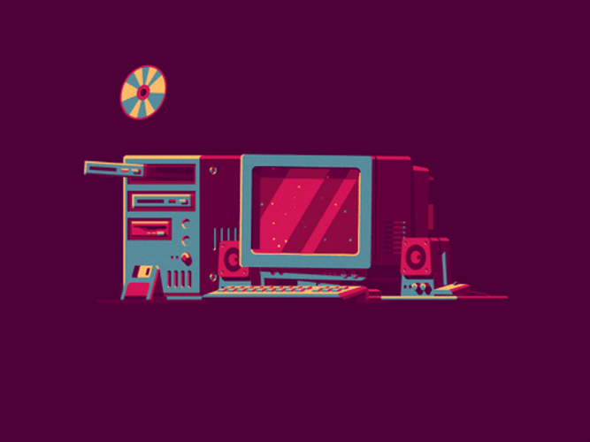

<h1 align="center">Amir Hosein Rajabpoor</h1>
<h3 align="center"></h3>

  

#

 

- 🌱 I’m currently learning **HTML, CSS, Javascript & React**

   

- 👨‍💻 All of my projects are available at [https://github.com/AmirHosein-RJP](https://github.com/AmirHosein-RJP)

   

- 💬 Ask me about **Programming Stuff**

   

- 📫 How to reach me **RP.amir2001@gmail.com**

 

#

<h3 align="center">Connect with me</h3>

#

<h3 align="center">Languages and Tools:</h3>

       

#

&nbsp;

       

